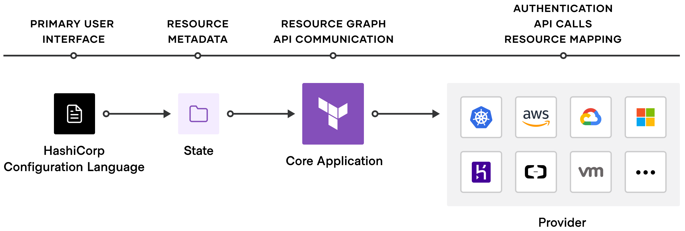

<!--
**abrashamchowdhury/abrashamchowdhury** is a ✨ _special_ ✨ repository because its `README.md` (this file) appears on your GitHub profile.

Here are some ideas to get you started:

- 🔭 I’m currently working on ...
- 🌱 I’m currently learning ...
- 👯 I’m looking to collaborate on ...
- 🤔 I’m looking for help with ...
- 💬 Ask me about ...
- 📫 How to reach me: ...
- 😄 Pronouns: ...
- ⚡ Fun fact: ...
-->

---

<h2> Hello, and welcome!</h2>

 
 

## The Deets

### Who I am

An engineer passionate about DevOps and IaC

### What I do

Terraform, Ansible, Kubernetes, Serverless and all that jazz

<!-- Just a hack for a thin line  -->
##

### My Stack

 </n>
 </n>
 </n>
 </n>
 </n>
 </n>
</n>
 </n>
 </n>
 </n>

---
